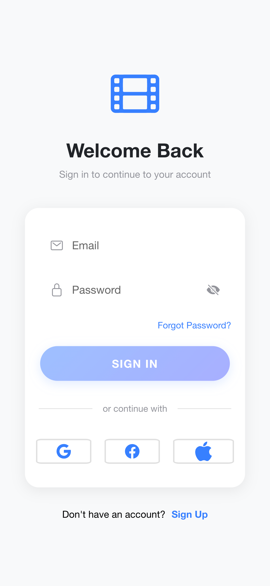
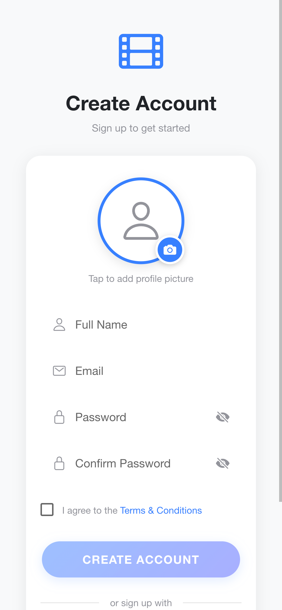
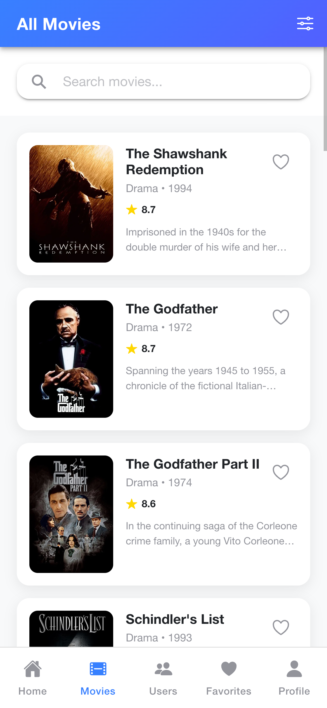
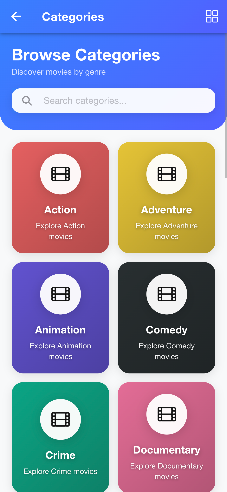
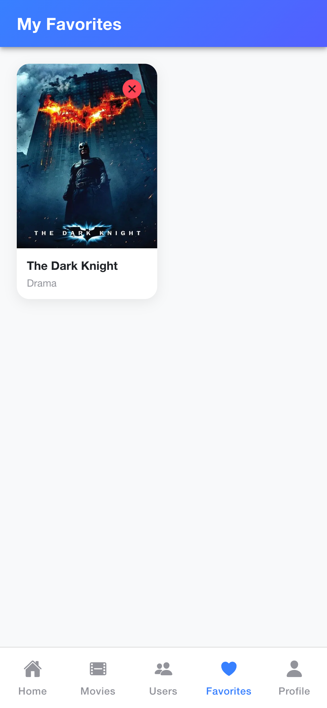
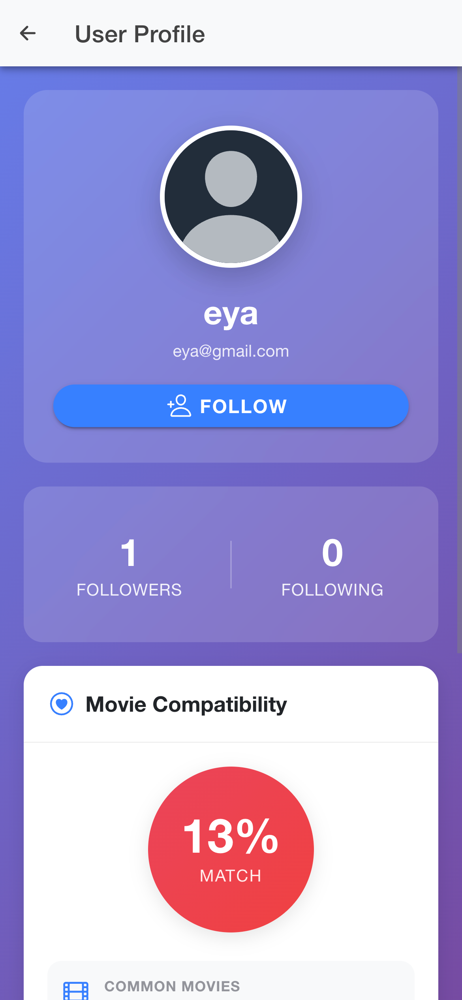

# 🎬 Movies Ionic Project

A comprehensive mobile-first movie discovery application built with Ionic Framework and Angular, featuring real-time Firebase integration, social features, and a modern user experience. This app allows users to discover movies, manage favorites, connect with other movie enthusiasts, and share their movie preferences.

## 📖 About The Project

Movies Ionic Project is a full-featured cross-platform mobile application that combines movie browsing capabilities with social networking features. Users can explore movies by categories, maintain their favorite lists, follow other users, and discover what movies their friends are watching. The application leverages Firebase for authentication and real-time data synchronization, providing a seamless experience across iOS, Android, and web platforms.

### Key Highlights

- **Movie Discovery**: Browse thousands of movies with detailed information, cast, crew, and ratings
- **Social Networking**: Follow users, see their favorite movies, and discover new content through your network
- **Real-time Updates**: Firebase Firestore integration ensures your data is always synchronized
- **Cross-Platform**: Built with Capacitor for native iOS, Android, and web deployment
- **Modern UI**: Sleek interface built with Ionic components and custom theming

## ✨ Features

### 🔐 User Authentication

- Email/Password registration and login
- Social authentication support (Google, Facebook, Apple)
- Secure authentication with Firebase Auth
- Protected routes with authentication guards
- Password reset functionality
- User profile management with avatar support

### 🎥 Movie Features

- Browse movies by category (Popular, Top Rated, Upcoming, Now Playing)
- Detailed movie information including cast, crew, and production details
- Add/remove movies to favorites
- Search and filter capabilities
- Movie ratings and reviews
- High-quality movie posters and backdrops

## 📸 Screenshots

### Authentication Screens

|          Login Screen           |            Register Screen            |
| :-----------------------------: | :-----------------------------------: |
|  |  |

### Main Application Screens

|          Home Screen          |            Movies List            |                Categories                 |
| :---------------------------: | :-------------------------------: | :---------------------------------------: |
|  |  |  |

### Movie Details & Favorites

|                  Movie Details                   |               Favorites                |
| :----------------------------------------------: | :------------------------------------: |
|  |  |

### Social Features

|                                Profile Screen                                |             User Matching             |
| :--------------------------------------------------------------------------: | :-----------------------------------: |
| .png>) |  |

### 👥 Social Features

- User profiles with customizable avatars
- Follow/unfollow other users
- View followers and following lists
- Discover other users' favorite movies
- Matching system to find users with similar tastes
- Real-time updates on social interactions

## 🛠️ Technologies Used

### Frontend Framework

- **Ionic Framework** `8.0.0` - Mobile UI framework
- **Angular** `20.0.0` - Web application framework
- **TypeScript** `5.8.0` - Programming language
- **RxJS** `7.8.0` - Reactive programming
- **Ionicons** `7.0.0` - Icon library

### Backend & Database

- **Firebase** `12.5.0` - Backend as a Service
- **@angular/fire** `20.0.1` - Angular Firebase integration
- **Firestore** - NoSQL cloud database
- **Firebase Authentication** - User authentication service

## 📋 Prerequisites

Before you begin, ensure you have the following installed:

- [Node.js](https://nodejs.org/) (v18 or higher recommended)
- [npm](https://www.npmjs.com/) or [yarn](https://yarnpkg.com/)
- [Ionic CLI](https://ionicframework.com/docs/cli) - Install globally: `npm install -g @ionic/cli`
- [Angular CLI](https://angular.io/cli) - Install globally: `npm install -g @angular/cli`

### For Mobile Development

- **Android**: [Android Studio](https://developer.android.com/studio) with Android SDK
- **iOS**: [Xcode](https://developer.apple.com/xcode/) (macOS only) with iOS SDK
- **Java Development Kit (JDK)** - Required for Android development

### Additional Requirements

- **Firebase Account** - Create a free account at [Firebase Console](https://console.firebase.google.com/)
- **TMDB API Key** - Sign up at [The Movie Database](https://www.themoviedb.org/) for movie data access
- **Git** - For version control
